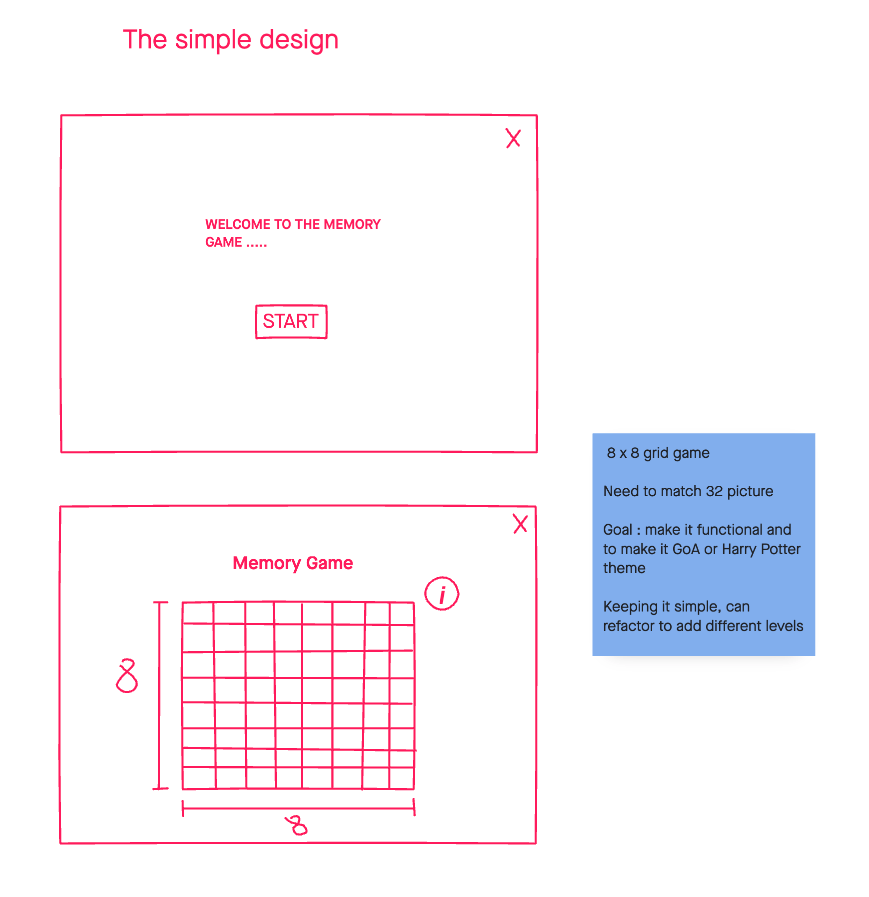

# Memory Game 

### Date: Febuary 12, 2021

#### Author: Faryal Ansari

[GitHub](https://github.com/f-ansari) | 
[LinkedIn](https://www.linkedin.com/in/faryal-a-43505b154/)

***

#### ***Description***

The Memory Game is a simple game, where the user chooses two cards from an 6 x 6 grid to see if they match. A match could be same image, number, or color. If the user chooses two cards that do not match, the card will flip back down to their original places for the user to pick agian. If they do match, the card will be removed from the board game, so the the user may complete it. 

#### Functions of the game: 
  * Randomize the card before playing
  * Match cards and remove them from board 
  * Flips cards back when not match 
  * Keeps reack how many Matches and Attempts were made

### ***Technologies***

* HTML
* CSS
* JavaScript

***

### ***Getting Started***

To get started, click [click here](https://trello.com/invite/b/TWfgboGF/cf4c0a319a6e51959ec4266be64018cc/memory-game) and visit my trello board to follow the development of this game.

***

### ***Screenshots***

This was the original plan.

***

Final Product 

***

### ***Future Updates***

- [x] Change border color when matched
- [x] Add Match and Attempts made counter 
- [ ] Add a celebration sound when all matches are made
- [ ] Make user choose board size
- [ ] Add sounds to when user clicks board

### ***Credits***

* N/A